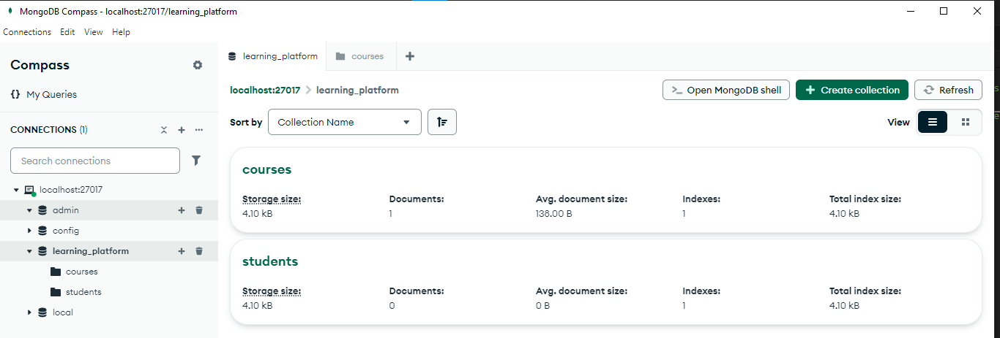

# Projet de fin de module NoSQL
API backend pour une plateforme d'apprentissage en ligne, construite avec Node.js, MongoDB et Redis. Ce projet suit une architecture moderne et des bonnes pratiques de développement.

### Installation et Lancement du Projet
Pour installer et lancer le projet, suivez les étapes ci-dessous :

1. **Cloner le dépôt :**
   ```bash
   git clone https://github.com/AzmiZakaria/learning-platform-nosql.git
   cd learning-platform-nosql
   ```
2. **Installer les dépendances :**
   ```bash
   npm install
   ```
3. **Configurer les variables d'environnement :**
   Créez un fichier `.env` à la racine du projet et ajoutez les variables nécessaires.
4. **Lancer le serveur :**
   ```bash
   npm start /src/app.js
   ```

5. **Accéder à l'API :**
   Ouvrez votre navigateur et allez à `http://localhost:3000` pour accéder à l'API.


### La structure du projet
   Le projet est organisé de manière modulaire pour assurer une séparation claire des responsabilités et une maintenance facile. Voici un aperçu de la structure du projet :
```
   ├── src/
   │   ├── config/
   │   │   ├── db.js         # Configuration des bases de données
   │   │   └── env.js        # Gestion des variables d'environnement
   │   ├── controllers/
   │   │   └── courseController.js  # Logique de gestion des cours
   │   ├── routes/
   │   │   └── courseRoutes.js      # Définition des routes API
   │   ├── services/
   │   │   ├── mongoService.js      # Service MongoDB
   │   │   └── redisService.js      # Service Redis et cache
   │   └── app.js                   # Point d'entrée de l'application
   ├── .env                         # Variables d'environnement
   ├── package.json
   └── package-lock.json
```

### Les choix techniques
1. Architecture
   - Pattern MVC : Séparation claire entre les modèles, vues et contrôleurs
   - Architecture en couches : Routes → Contrôleurs → Services → Base de données
   - Design Patterns : Service Pattern pour une meilleure abstraction des données

2. Base de données
   - MongoDB : Utilisé pour stocker les données de manière persistante avec une structure flexible et évolutive. MongoDB est une base de données NoSQL orientée documents, ce qui permet de gérer des données semi-structurées et non structurées efficacement.
   - Redis : Utilisé comme cache pour améliorer les performances de l'application en stockant temporairement les données fréquemment consultées. Redis est une base de données en mémoire, clé-valeur, qui offre des temps de réponse très rapides.

### Les Outils
1. **MongoDB Compass :**
   Interface graphique pour visualiser, analyser et manipuler les données MongoDB.
   

2. **Redis CLI :**
   Outil en ligne de commande pour gérer et déboguer les données en cache Redis.
   

### acces a main route `http://localhost:3000/`


